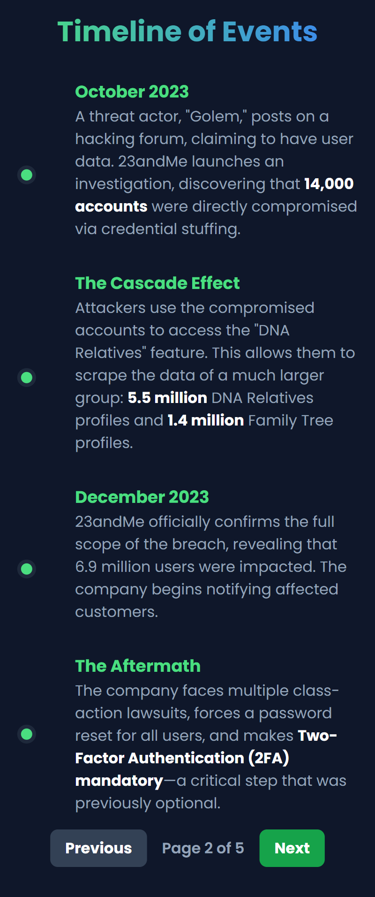
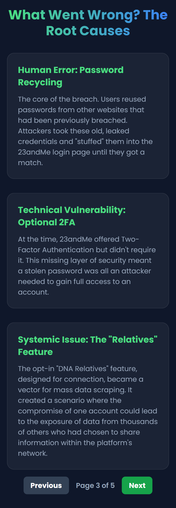
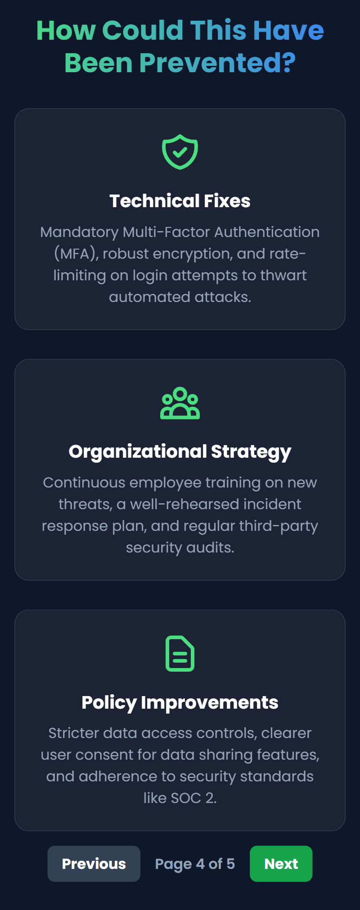
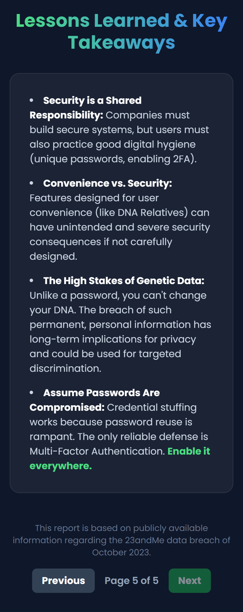

*Project Context: I wrote this technical breakdown as part of my CCNA and WGU Cloud & Network Engineering studies to document my understanding of core networking concepts.*

# Beyond the Firewall: The 23andMe Breach and the Alarming Power of a Single Stolen Password

*A single stolen password acts as a key, unlocking a vast, interconnected network of sensitive genetic data.*

## Introduction

In the world of cybersecurity, we often visualize breaches as sophisticated assaults on fortified digital perimeters. But what happens when the attackers don't need to break down the door? What if they can just walk in with a key? The October 2023 data breach at 23andMe is a sobering case study that every business leader and security professional needs to understand. It wasn't a complex zero-day exploit that compromised the data of nearly 7 million users; it was something far more common and, arguably, more insidious: **credential stuffing**.

This incident is more than just another headline. It's a critical lesson in the cascading consequences of basic security oversights, the unique dangers of interconnected platforms, and the profound, permanent risk associated with compromised genetic data.

## What Happened? A Timeline of a Simple Attack with Massive Consequences

The 23andMe breach unfolded not as a single event, but as a chain reaction, where a small crack in security led to a catastrophic failure.

- **The Foothold (October 2023):** Attackers gained access to approximately 14,000 user accounts. They did this by "stuffing" usernames and passwords, stolen from previous breaches on other websites, into the 23andMe login portal. Because users had recycled their passwords, these old keys worked.
- **The Cascade Effect:** This is where the true scale of the disaster became apparent. The attackers leveraged an opt-in feature called *DNA Relatives*. By using the initially compromised accounts, they were able to scrape data from connected profiles. This exponentially expanded the breach to affect an additional **5.5 million DNA Relatives profiles** and **1.4 million Family Tree profiles**.
- **The Aftermath:** Facing immense public and regulatory pressure, 23andMe was forced to implement a mandatory password reset for all users and, crucially, make Two-Factor Authentication (2FA) a requirement, a security measure that had previously been optional.

## The Anatomy of Failure: What Went Wrong?

Three key factors created the perfect storm for this breach:

- **Human Error. The Password Recycling Epidemic.** The breach was fundamentally enabled by users' poor password hygiene. As cybersecurity expert Troy Hunt, creator of *Have I Been Pwned*, often emphasizes, password reuse is the "gift that keeps on giving for attackers." In a corporate environment, this underscores the critical need for user education and policies that discourage or prevent password reuse.
- **Technical Vulnerability, Optional Security.** Making 2FA optional was a critical misstep. In today's threat landscape, a password alone should never be considered sufficient protection for sensitive data. CISA is unequivocal on this point, stating that enabling MFA is "one of the single most important things you can do to secure your accounts."
- **Systemic Risk. Features as a Flaw.** The *DNA Relatives* feature, designed to enhance user experience and connection, became a powerful tool for mass data exfiltration. Every feature that allows data sharing must be scrutinized for its potential to be abused at scale.

## Actionable Insights & Lessons Learned

### For Business Leaders & Strategists

- **Security is a product feature, not an IT problem.** The failure of *DNA Relatives* from a security perspective demonstrates that security must be baked into product design from day one, not bolted on as an afterthought.
- **The true cost of a breach is reputational.** While the financial costs of lawsuits and remediation are significant, the damage to customer trust, especially when dealing with immutable data like DNA, can be irreparable.
- **Re-evaluate your data's "blast radius."** Do your internal systems allow a minor compromise in one area to cascade into a major incident in another? Understanding these connections is key to containment.

### For IT & Cybersecurity Professionals

- **Enforce MFA aggressively.** The single most effective technical control that could have prevented this breach is mandatory Multi-Factor Authentication.
- **Monitor for credential stuffing.** Implement rate limiting on login attempts, use bot detection services, and monitor for high volumes of failed logins from disparate IP addresses.
- **User training is non-negotiable.** Regularly train employees on the dangers of phishing and password reuse. Provide them with tools like password managers.

## The Broader Implications: You Can't Reset Your DNA

This breach has pushed the conversation about data privacy into new territory. A stolen credit card can be canceled, and a password can be changed. Genetic data, however, is permanent. Its exposure creates risks of targeted discrimination by insurers, employers, or even malicious actors that may not be fully realized for years to come.

Steve Stone, Head of Rubrik Zero Labs, captured the gravity of the situation in his response to the breach:

> "The real story in the 23andMe hack is the type of data threat actors now have. We've become accustomed to stolen SSNs, bank numbers, etc. This is genetic information with all the associated implications (family, familial secrets, health information, etc.)."

The 23andMe breach is a stark reminder that as we entrust our most personal information to technology platforms, the responsibility to protect that data, shared between the user and the company, has never been greater. It's time to move beyond the firewall and focus on the fundamentals that truly keep us secure.

## References

1. Hunt, Troy. General commentary on password reuse, widely attributed and reflected in his work on HaveIBeenPwned.com.
2. Cybersecurity & Infrastructure Security Agency (CISA). "Multi-Factor Authentication (MFA)." cisa.gov.
3. Stone, Steve. Quoted in "6.9 Million 23andMe Users Affected by Data Breach." *The HIPAA Journal*, December 5, 2023.

---

## Visual Reference

The original write-up included additional companion visuals documenting the breach narrative:

---

**Tags:** `#cybersecurity` `#databreach` `#23andMe` `#privacy` `#infosec` `#riskmanagement` `#credentialstuffing` `#MFA` `#leadership`
