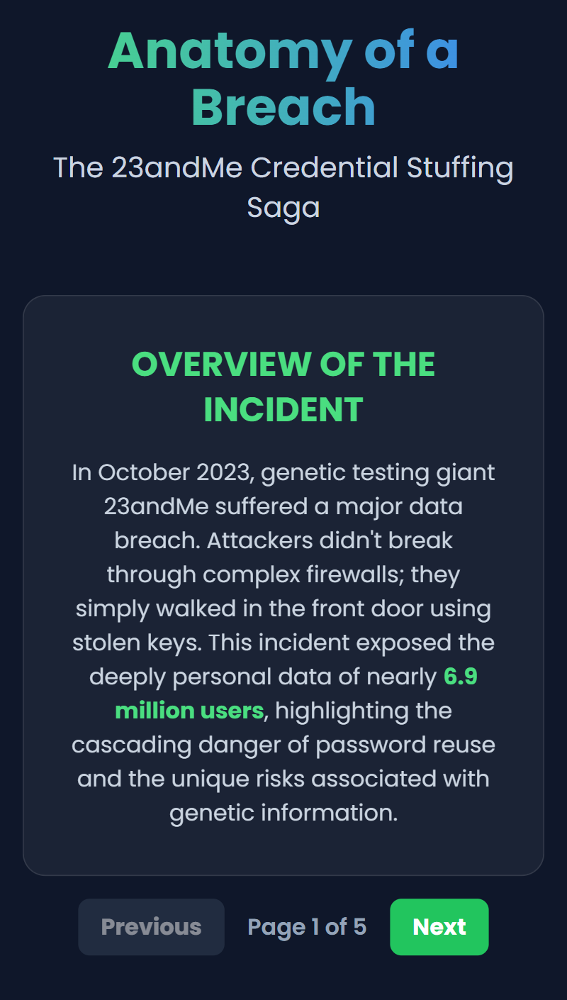

# Network Engineering Portfolio

**Author:** Charles Prestridge, U.S. Navy Veteran · Network Infrastructure Technician
**Focus:** CCNA · WGU Cloud & Network Engineering · Cybersecurity Fundamentals

---

## About Me

I'm **Charles Prestridge**, a U.S. Navy veteran transitioning my career into network engineering and cloud infrastructure. After years of service, I'm now applying the same discipline, attention to detail, and mission-first mindset to the world of enterprise networking and cybersecurity.

I currently work as a **Network Infrastructure Technician** while pursuing my **Cisco Certified Network Associate (CCNA)** certification and a **B.S. in Cloud & Network Engineering** through **Western Governors University (WGU)**. This repository is my living, public-facing portfolio, a place to document what I'm learning, prove out concepts in writing, and share the technical breakdowns I've built along the way.

### What you'll find here

Each article in this repo is a deliberate, citation-backed write-up on a core topic in modern network and security engineering, written to reinforce my own understanding and to be useful to anyone preparing for similar certifications or stepping into the same field.

### What I'm focused on

- **Networking fundamentals**: OSI, TCP/IP, routing, switching, subnetting, and modern SDN concepts
- **Cybersecurity**: credential hygiene, MFA, EDR, Zero Trust, malware defense, and data handling policy
- **Cloud & infrastructure**: hybrid backup strategies, DRaaS, and cloud-first network design
- **Operations & leadership**: change management, workstation hardening, and building secure habits at scale

---

## Articles: Table of Contents

| # | | Article | Focus |
|---|---|---------|-------|
| 1 |  | [Beyond the Firewall: The 23andMe Breach and the Alarming Power of a Single Stolen Password](Beyond-the-Firewall.md) | Credential stuffing · MFA · Incident analysis |
| 2 |  | [Blueprint for Trust: The Pillars of a Modern Data Handling Policy](Blueprint-for-Trust.md) | Data governance · GDPR · CCPA · NIST SP 800-88 |
| 3 |  | [Code Warriors, Assemble: Choosing Your Weapon in the World of Scripting](Code-Warriors-Assemble.md) | Python · Bash · PowerShell · JavaScript |
| 4 |  | [Digital Exterminators: Choosing Your Weapon in the War Against Malware](Digital-Exterminators.md) | Malwarebytes · Norton Power Eraser · Kaspersky |
| 5 |  | [Don't Just Announce It, Ace It: A Leader's Playbook for Change That Actually Works](Dont-Just-Announce-It-Ace-It.md) | Change management · Adoption · KPIs |
| 6 |  | [Your PC is a Fortress: Are You Leaving the Front Gate Wide Open?](Fortifying-the-Front-Lines.md) | Workstation hardening · BitLocker · UAC · AppLocker |
| 7 |  | [Not All Backups Are Created Equal: Your Guide to Smarter Data Protection](Not-All-Backups-Are-Created-Equal.md) | Hybrid cloud · DRaaS · 3-2-1-1-0 rule |
| 8 |  | [The Digital Shapeshifters: Navigating the Evolving Landscape of Malware in 2025](The-Digital-Shapeshifters.md) | AI-driven malware · EDR · Deception technology |
| 9 |  | [The Untapped Potential in Tomorrow's Network Engineers](The-Untapped-Potential.md) | SDN · Zero Trust · Talent strategy |
| 10 |  | [Your Browser: Gateway to the Web or Playground for Hackers?](Your-Browser-Gateway-or-Playground.md) | XSS · Clickjacking · MitM · Browser security |
| 11 |  | [Your Data's Guardian Angel: A Fun, Hands-On Guide to Backups](Your-Datas-Guardian-Angel.md) | Full vs. incremental backups · 3-2-1 rule |

---

## Why This Portfolio Exists

> "Tell me and I forget. Teach me and I remember. Involve me and I learn.", Benjamin Franklin

Writing forces clarity. Every article in this repository started as a study topic from my CCNA or WGU coursework, and the act of turning it into a publishable, reference-citing breakdown is what cements the concept in my own head. Each piece is meant to be the kind of explanation I wish I'd had when I first encountered the topic, clear, opinionated where it needs to be, and grounded in the real-world incidents and standards that shape the field.

If you're a hiring manager, classmate, or fellow learner, welcome. I hope you find something here worth your time.

---

## Connect

- **Author:** Charles Prestridge
- **Role:** Network Infrastructure Technician
- **Studying:** CCNA · WGU B.S. Cloud & Network Engineering
- **Background:** U.S. Navy Veteran
